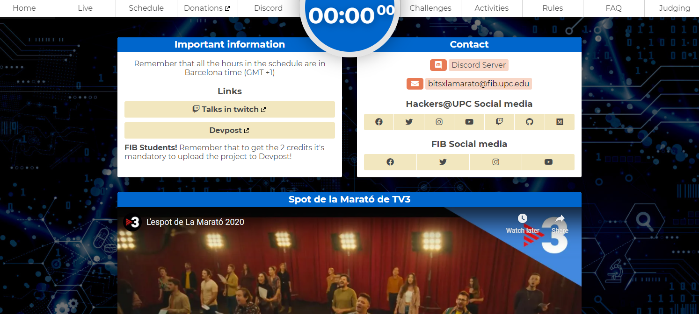

# bits-live



Hi! This is the code of bitsxlaMarato 2020 (Online edition) live page.

## Live

Features included

- Optional subscription to events - 5 minutes before notifications
- Schedule live reload
- Fancy schedule with time padding
- Normal tabular schedule
- Countdown
- Full-screen mode by pressing `p`

## Site Sections

All the sections this live page includes:

- **Home**: Important information to know during the event.
- **Live**: live realoading schedule.
- **Schedule**: All information of the schedule (title, description and time of all the activities happening).
- **Donation**: Goes into another webpage.
- **Discord**: All the information the hacker needs to know about the discord server.
- **Challenges**: Challenges proposed for the hackathons (link to the opening explanation of the challenge).
- **Activities**: All the information about the activities that will take place during the event.
- **Rules**: Hackathon rules.
- **FAQ**: All the questions and answers the hackers may have during the event.
- **Judging**: Judging criteria the hackers needs to know to develop their project.

### Config

Some parameters (offsets, timeouts, defaults) can be changed in `src/config.js`. Keep in mind that some values are just constants and should not be changed.
Here you can edit the `FAKE_DATE` parameter to test funtionalities.

## Edit content

### Change theme

If you want to change the theme you should change some properties
1. For changing the background imatge: Go to `public/assets/live/bg.jpg` and replace it with the one you want (with the same name).
2. For changing all the colors: Go to `src/live/params.scss` and in the top of the file you will find all the colors.

### Update schedule

To update or change the schedule go to `public/data/schedule.json`. Changing this file will change the live and the schedule section. Here you can also set the start of the hackathon. The duration of it must be changed in `src/config.js`.

#### Schedule file

- `id` can be whatever you want, but all ids must be different  
- When writing hours, prepend zeroes: Nice: 01:00; Not-so-nice: 1:00.  
- Events should be ordered by starting hour  
- `baseTimeOffset` should be the same output as executing (new Date()).getTimezoneOffset() in a machine with local time. (UTC - localtime in minutes)  
- `dates` are DD/MM/YYYY format  

> If an event doesn't have endHour, then will show only startHour and it will finish at the same time as it starts.  
Useful to specify events that don't have concept of length or that span through more than one day ("Event start", "Event end")

## Setup

```sh
git clone git@github.com:hackupc/bits-live-2020.git
cd bits-live-2020
npm install
```

Use `npm run serve` to compile and serve the dist directory in real time. Then view the website at [https://localhost:8080](https://localhost:8080)

```sh
npm run serve
```

## Deploy

### Deploy to localhost

Use `npm run build` to compile all dist directory. The files will be compiled to `/dist/`.

Use `serve -s dist` to just serve `/dist` at [https://localhost:5000](https://localhost:5000).

```sh
npm run build
serve -s dist
```

### Deploy to production

**Push to master**. [Netlify](https://app.netlify.com/sites/bits-live-2020) will build and deploy automatically.

If you push something that doesn't build, don't worry, it won't be published.

## Support

If you need help understanding something of this repo you can ask the previous developers. The ones that made this edition live were:

- Carlota Catot Bragós: Slac `@Carlota` [carlotacb.dev](https://carlotacb.dev/)
- Maurici Abad Gutierrez: Slack `@mauriciabad` [mauriciabad.com](https://mauriciabad.com/)

## License

MIT © Hackers@UPC
